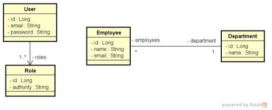

# Desafio Empregados Auth - TDD resolvido

Foram implementadas as funcionalidades necessárias para que os testes do projeto passassem.

## Relacionamento
Este é um sistema de funcionários e departamentos com uma relação N-1 entre eles, e o relacioanmento
de Users e Roles.

## Testes de Integração
Os testes de integração foram feitos com o banco de dados em memória H2, e para isso foi utilizado o
módulo `spring-boot-starter-data-jpa` e `spring-boot-starter-test` para a configuração do banco de dados
e para a configuração do teste, respectivamente.

#### Links
[ Postman Collection](.github/DesafioEmpregadosAuth.postman_collection.json)